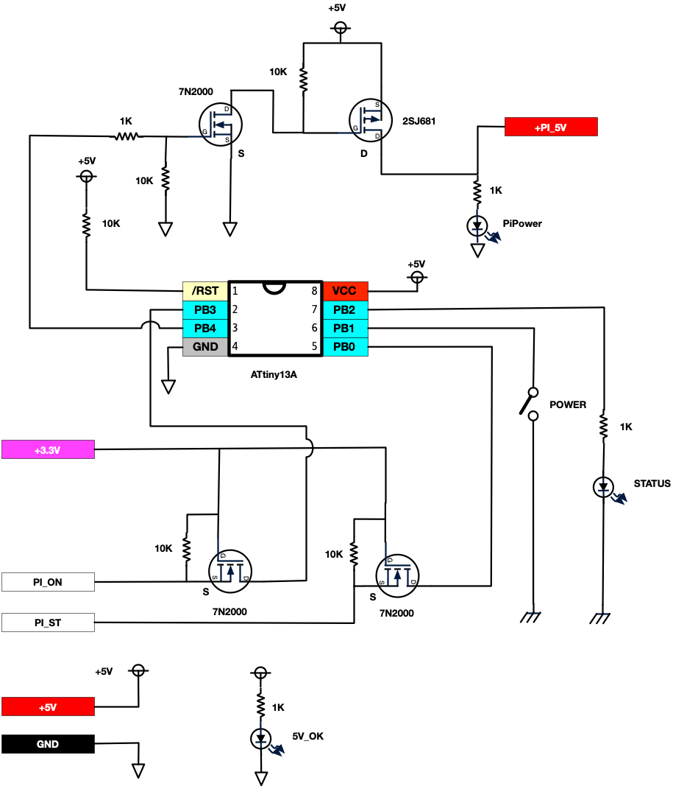

# Raspberry Piパワーコントローラ

* トグルスイッチでラズベリーパイの起動・終了を行う回路です。
* Raspberry PiへはGPIO +5Vから電源を供給します。

## 起動シーケンス

ステータスLED | 状況
--------------|---------------
高速点滅 | RPiブート開始前
点滅     | RPiブート中
点灯     | RPi起動完了・動作中
点滅     | シャットダウン中

以下の場合、強制的に電源がオフにされます。

* RPiブート中にトグルスイッチがオフにされた
* シャットダウン中に一定時間以上経過した

なお、トグルスイッチオンの状態で、RPiからパワーオフを行うと、再度起動が行われます。

Controller | 方向   | Raspberry Pi
-----------|--------|---------------
+5V        | 出力   | +5V
+3.3V      | 入力   | +3.3V
GND        |        | GND
PI_ON      | 入力   | GPIO 27
PI_ST      | 入出力 | GPIO 22

# Raspberry Pi側の設定

Raspbian用

* [boot-config.txt](rpi/boot-config.txt) を /boot/config.txt に追記
* [state-toggle.sh](rpi/state-toggle.sh]) を実行権限をつけて適当なところにおいて、/etc/rc.local などからバックグラウンドで起動する。

# 制作時の留意点

* RPi3以降の機種は電圧降下(電源抵抗)にシビアです。Pch MOSFETと電源の配線は太い配線で最短距離でおこなってください。
* GPIO給電の場合USB電源部分に搭載されているポリスイッチや理想ダイオードがバイパスされる機種があります。
* 安定した利用には、[Raspberry Pi 回路図](https://www.raspberrypi.org/documentation/hardware/raspberrypi/schematics/README.md) を参考にして、USB電源部近くのランドに半田付けなどをおすすめします。
